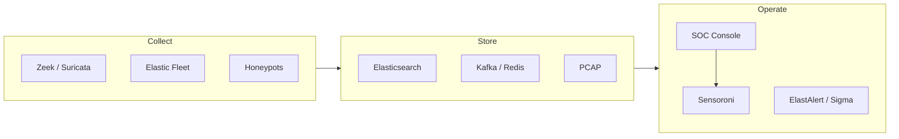

<p align="center">
  
</p>

<p align="center">
  <strong>The open network security monitoring platform for modern SOCs.</strong><br>
  Threat hunting · Enterprise monitoring · Log management · Grid-scale operations
</p>

<p align="center">
  <a href="https://docs.securityonion.net">Documentation</a> ·
  <a href="https://securityonion.net/docs/download">Download</a> ·
  <a href="https://github.com/Security-Onion-Solutions/securityonion/discussions">Community</a> ·
  <a href="https://securityonionsolutions.com/pro">Security Onion Pro</a>
</p>

---

## Overview

**Security Onion** is a free, open Linux distribution for security teams who need full-stack visibility—network, host, and cloud-adjacent telemetry—in one cohesive platform. Deploy a single sensor or a distributed **grid** of managers, search nodes, and fleet-backed endpoints, then investigate from a unified console backed by Elasticsearch.

Built for operators who care about depth: metadata, IDS alerts, endpoint telemetry, PCAP, enrichment, and automation—without stitching together a dozen disconnected tools.



---

## Platform capabilities

| Layer | What you get |
| :--- | :--- |
| **Console** | [Security Onion Console (SOC)](https://docs.securityonion.net) — cases, detections, grid management, integrations |
| **Search** | Elastic Stack — fast search, dashboards, detection engineering |
| **Network** | Suricata IDS, Zeek metadata, full packet capture |
| **Endpoint** | Elastic Fleet & Elastic Defend — host visibility and response hooks |
| **Enrichment** | Sensoroni analyzers — VirusTotal, OTX, GreyNoise, and more |
| **Automation** | Salt-based grid orchestration, playbooks, firewall & response tooling |
| **Hardening** | [Elite security layer](docs/ELITE_SECURITY.md) — zero-trust enrichment, control-plane guardrails, `so-verify` |

---

## Quick start

| Step | Link |
| :--- | :--- |
| Download ISO | [securityonion.net/docs/download](https://securityonion.net/docs/download) |
| Hardware planning | [securityonion.net/docs/hardware](https://securityonion.net/docs/hardware) |
| Installation | [securityonion.net/docs/installation](https://securityonion.net/docs/installation) |
| Release notes | [securityonion.net/docs/release-notes](https://securityonion.net/docs/release-notes) |

After install, open the SOC web UI on your manager node and follow the setup wizard to join sensors and search nodes to your grid.

---

## Deploy anywhere

Security Onion runs on bare metal, VMs, and major cloud marketplaces:

- [AWS](https://aws.amazon.com/marketplace)
- [Azure](https://azure.microsoft.com/marketplace)
- [Google Cloud](https://console.cloud.google.com/marketplace)

Air-gapped and high-side deployments are supported—see the [documentation](https://docs.securityonion.net) for grid topologies and sizing.

---

## Security Onion Pro

**[Security Onion Pro](https://securityonionsolutions.com/pro)** extends the platform for organizations that need scale, support, and advanced workflows:

- **Onion AI** — AI-assisted investigation and case workflows
- **Enterprise grid** — hypervisor provisioning, advanced licensing, priority support
- **Operational efficiency** — features tuned for large, multi-site deployments

---

## Repository layout

This repository contains the **Salt states, configuration, and automation** that define a Security Onion grid—not the full SOC application binary (shipped in platform images).

| Path | Purpose |
| :--- | :--- |
| `salt/` | Service definitions, pillar defaults, manager tools |
| `salt/sensoroni/` | Per-node agent, analyzers, enrichment |
| `salt/soc/` | Console config, playbooks, AI guardrail schemas |
| `salt/common/tools/sbin/` | Shared utilities (`so-verify`, `so_security_utils.py`) |
| `tests/security/` | Security regression & attack simulation (`so-attack.py`) |
| `docs/ELITE_SECURITY.md` | Elite hardening guide |

---

## Security & integrity

Security Onion is designed for environments where the control plane and enrichment layer are part of the attack surface. This repo includes an optional **elite security** stack:

```bash
so-verify --strict
python3 tests/security/so-attack.py
```

Enable `elite_security` and `verify_cert` in Sensoroni grid settings for stricter validation, audit logging, and read-only analyzer mounts on sensors. Details: [docs/ELITE_SECURITY.md](docs/ELITE_SECURITY.md).

---

## Community & support

| Resource | URL |
| :--- | :--- |
| Documentation | [docs.securityonion.net](https://docs.securityonion.net) |
| FAQ | [securityonion.net/docs/faq](https://securityonion.net/docs/faq) |
| Discussions | [GitHub Discussions](https://github.com/Security-Onion-Solutions/securityonion/discussions) |
| Training | [securityonion.net/training](https://securityonion.net/training) |

---

## Contributing

We welcome issues, discussions, and pull requests. All commits must be **signed**. Please read [CONTRIBUTING.md](CONTRIBUTING.md) before opening a PR against the current `dev` branch.

---

## License

Security Onion is licensed under the terms in [LICENSE](LICENSE). Some components are subject to the [Elastic License 2.0](https://securityonion.net/license).

---

<p align="center">
  <sub>Built by <a href="https://securityonionsolutions.com">Security Onion Solutions</a></sub>
</p>
